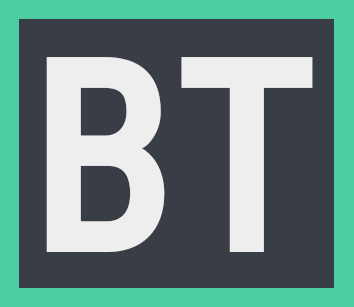

Cryptocurrency Simulator
======================

:star: Star us on GitHub — it helps!

[BlockTrade](https://project2-crypto.herokuapp.com/) is your source for cracking into the crypto market. It's a trade market simulator that gives you an imaginary $10,000.00 to spend in the market to test your luck with. 

### This was built as a UC Davis project group project. We built it out on a SQL database and with a React Front-End to make our currency simulator application better than ever

Sign up for a portfolio with us and play the cyrpto markets without the risk of losing your own money. This is a great application for you to realize your talents when it comes to investing in the markets prior to taking them on for real.

Contributions:
Front-End React was handled by Riley, Dakokta, Jake
Back-End implementation was handled by Aman, Jill and Jake

#### Note: to run the repo you will need the follow:
* to have a mysql server running
* to install the npm packages for react/express package.jsons
* to have a .env file with the db name/username/password
* to type to the cli "npm run dev"
